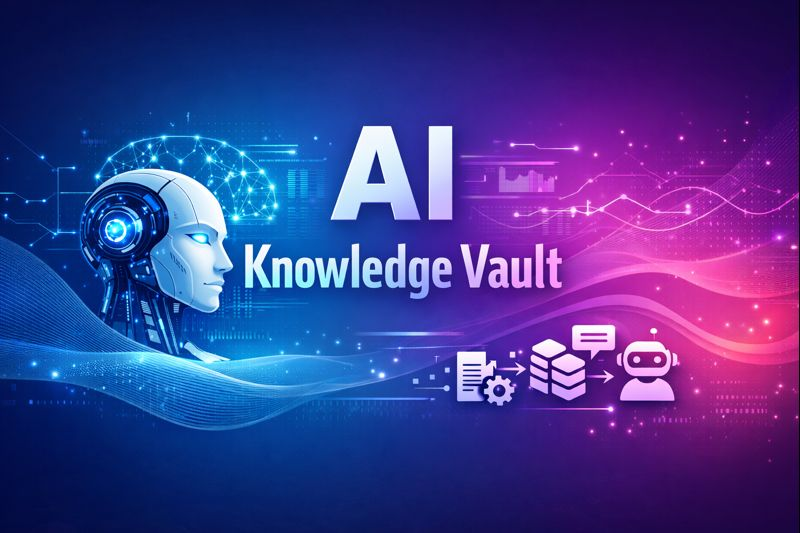
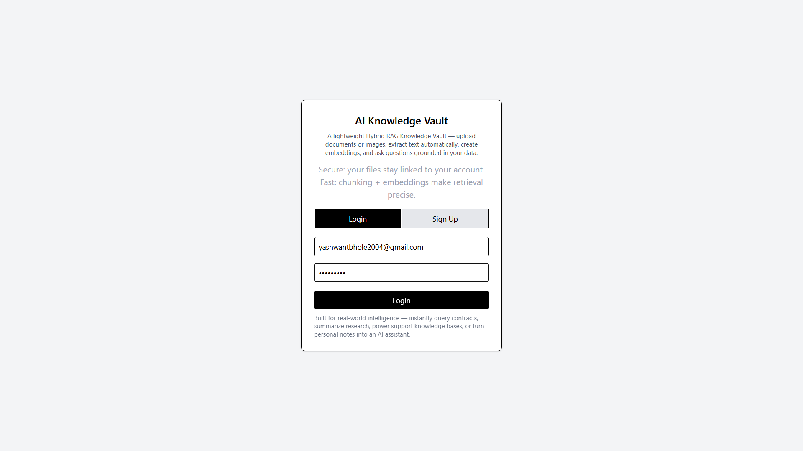
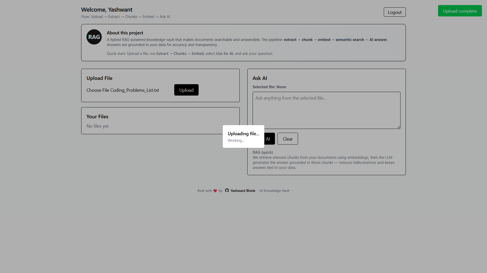
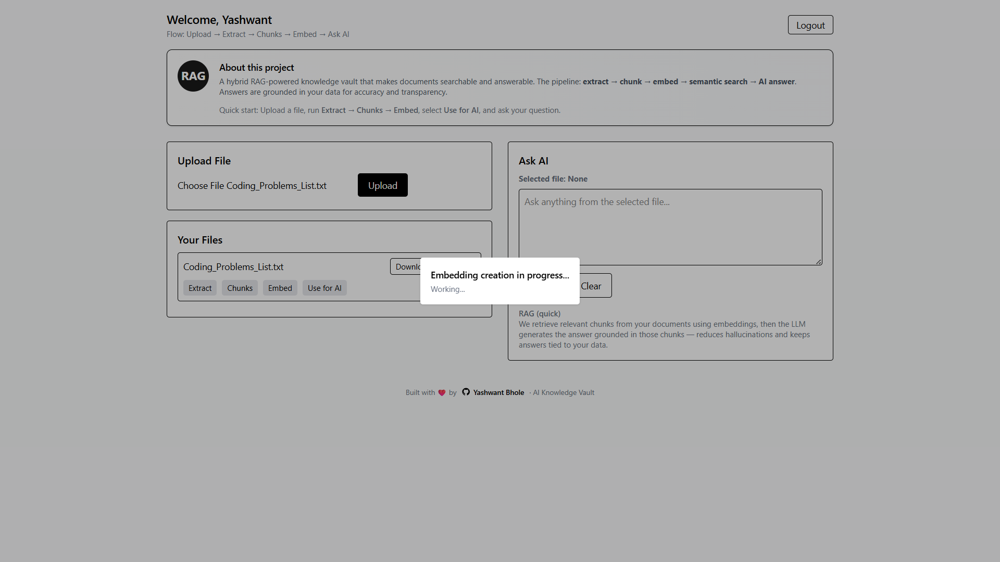
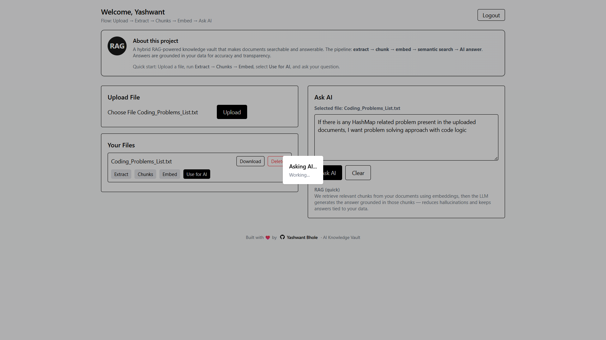
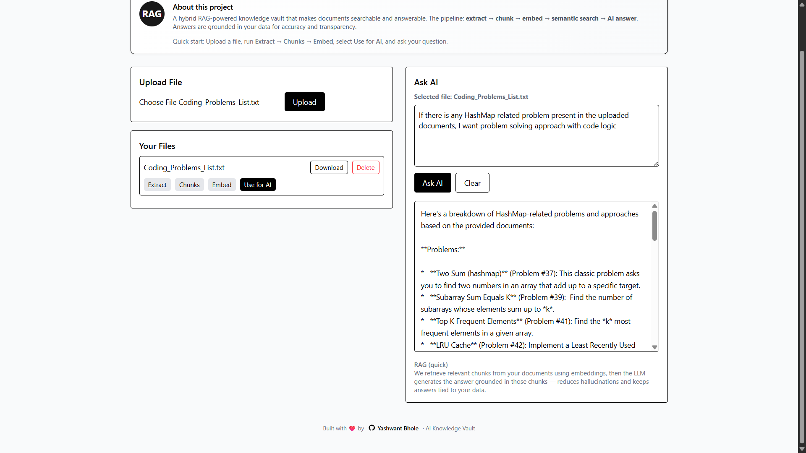

<div align="center">
  

# 📚 AI Knowledge Vault — Hybrid RAG System

> A **Hybrid Retrieval-Augmented Generation (RAG) Knowledge Vault** that lets users upload documents & images, extract text, generate embeddings, and ask intelligent questions grounded in their own data.

**A real-world AI system design** built using MERN, OCR, vector search, and LLMs in a clean, scalable pipeline.

</div>

---

## 🚀 Features

- 🔐 **Secure Authentication** — Files & data isolated per user  
- 📄 **Multi-format Support** — PDF, DOCX, TXT, PNG, JPG  
- 🧠 **Hybrid RAG Architecture**  
  - Document-grounded answers  
  - Optional fallback to general AI  
- 🔍 **Semantic Search** — Vector similarity search  
- 🖼️ **Image OCR Support** — Extract text from images & scanned PDFs  
- ✂️ **Intelligent Chunking** — Overlapping chunks retain context  
- 🤖 **AI Question Answering** — Grounded LLM responses  
- ⚡ **Fast Retrieval Pipeline**  
- 🧩 **Auditable Results** — Linked back to source chunks  

---

## 🖼️ Demo & Screenshots

Below are the key screens demonstrating the workflow.

### 🔐 Login  


### 📁 Upload Section  


### ⚙️ Processing Pipeline (Extract → Chunk → Embed)  


### 🤖 Ask AI Interface  


### 🧠 AI Structured Response  


---

## 🎥 Demo Video

[](https://github.com/YashwantBhole/ai-knowledge-vault-frontend/releases/download/project-demo-video/Screen.Recording.2025-12-21.123112.mp4)

> 📥 Click the thumbnail to download and watch the full demo.

---

## 🏗️ System Architecture

```
Upload File / Image
        ↓
Text Extraction (PDF Parser / OCR)
        ↓
Chunking (with contextual overlap)
        ↓
Embeddings (Gemini)
        ↓
Vector Search (Cosine Similarity)
        ↓
LLM Answer (Grounded in retrieved context)
```

---

## 🧠 What is Hybrid RAG?

Hybrid RAG blends:

- 📑 **Document-grounded answers**  
- 🧠 **AI general knowledge fallback**

This ensures:

✔ Reduced hallucinations  
✔ High accuracy  
✔ Great real-world usability  

---

## 🛠️ Tech Stack

### **Frontend**
- ⚛️ React  
- 🎨 Tailwind CSS  

### **Backend**
- 🟢 Node.js  
- 🚂 Express.js  
- 🍃 MongoDB (Mongoose)  

### **AI / ML**
- 🧠 Google Gemini (Embeddings + LLM)  
- 📐 Cosine Similarity (Vector Search)  

### **File Processing**
- 📄 pdf-parse  
- 🖼️ Tesseract.js (OCR)  
- ☁️ Backblaze B2 (S3-compatible storage)  

### **Auth**
- 🔑 JWT Authentication  
- 🔒 User-isolated access  

---

## 📡 API Workflow

| Step | Endpoint | Description |
|------|----------|-------------|
| 1️⃣ | `POST /api/process-file/:id` | Extract text |
| 2️⃣ | `POST /api/create-chunks/:id` | Create semantic chunks |
| 3️⃣ | `POST /api/create-embeddings/:id` | Generate embeddings |
| 4️⃣ | `POST /api/search-docs` | Vector similarity search |
| 5️⃣ | `POST /api/ask-docs` | Ask questions via RAG |

---

## 🧪 Example Use Cases

- 📑 Contract question answering  
- 📚 Coding interview preparation  
- 🔬 Research paper summarization  
- 💬 Internal support knowledge base  
- 🧠 Personal notes assistant  
- 🖼️ Query scanned notes / images via OCR  

---

## ▶️ Run Locally

### **Backend**
```bash
cd backend
npm install
npm run dev
```

### **Frontend**
```bash
cd frontend
npm install
npm run dev
```

---

## 🔮 Future Improvements

- 🏗 Background job queue for embeddings  
- 🔎 Hybrid keyword + vector search  
- 🎯 Source highlighting inside answers  
- ⚡ Streaming responses  
- 📚 Multi-file context aggregation  

---

## 👤 Author & Connect With Me

<div align="center">

### **Yashwant Bhole**

<a href="https://github.com/YashwantBhole" target="_blank">
  
</a>

<a href="https://www.linkedin.com/in/yashwantbhole" target="_blank">
  
</a>

<a href="mailto:yashwantbhole2004@gmail.com" target="_blank">
  
</a>

<br /><br />

💼 *Full Stack Developer • MERN • Java • Spring Boot*  
🌟 *Building AI-powered systems with clean architecture and strong UI/UX.*

</div>

---

## ⭐ Support

If you found this project helpful, please ⭐ **star** the repository — it encourages me a lot!

